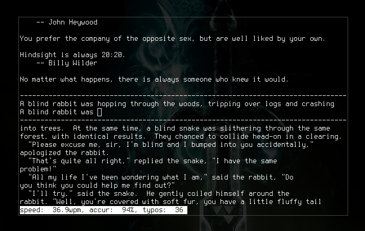

# typetod
##type everything forever
Here is [its tarball](https://github.com/raviqqe/typetod/raw/master/pkg/typetod-0.01.tar.gz).
And you can see [the videos on my website](http://www.raviqqe.com/typetod/).

## What is typetod?
typetod is a typing game that works on a terminal. It has four modes;

* fortune mode
* files mode
* RSS feeds mode
* stdin mode

When you choose stdin mode or others with -d option, typetod becomes endless
mode. It lets you type forever. And, typetod also evaluate your typing speed
and accuracy.

## Game modes
### fortune mode
  It takes benefitial tips from fortune command as samples.
### files mode
  Text files which are local or remote (http and ftp allowed as url schemes) as
  samples.
### RSS feeds mode
  If you specify the url of a RSS feed, items of the feed will appear on your
  screen. Then, you can select one of them as a sample.
### stdin mode
  In this mode, typetod reads lines one by one from stdin adding it to the
  buffer of samples during the game. You can use a pipe to do that.

## FAQ
### How do you pronounce it?
type-to-D
### What is its license?
typetod is unlicensed. I mean all source codes of typetod are in public domain
and anyone can utilize them for theirselves.
See [the page of unlicense.org](http://unlicense.org/).
### Incorporate my opinion!
Mail [me](mailto:raviqqe@gmail.com).
